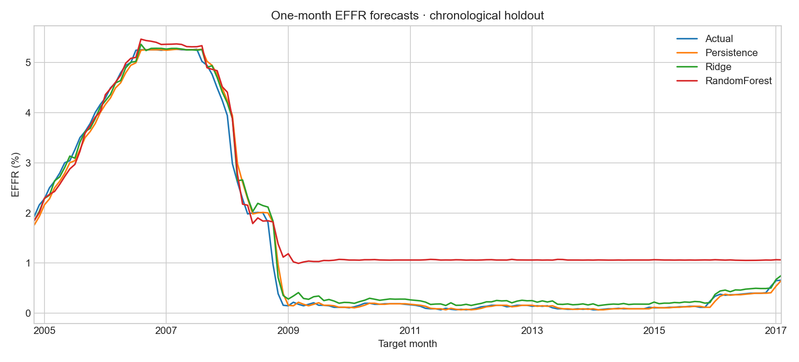
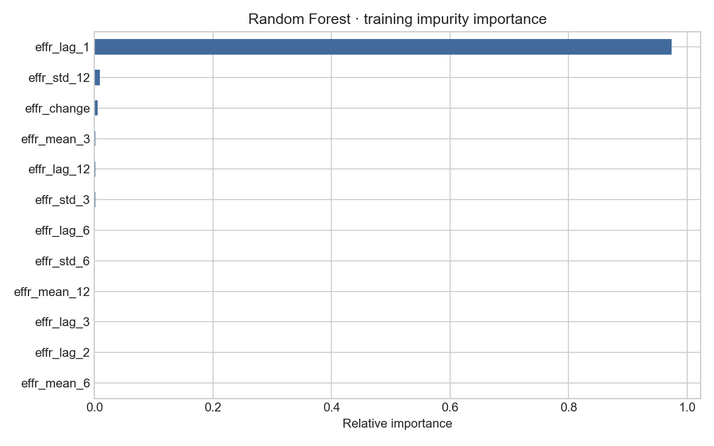

# Forecasting the Effective Federal Funds Rate

A reproducible study of **one-month-ahead EFFR forecasts**, comparing a persistence baseline, Ridge regression and Random Forest on historical monthly data. The project emphasizes chronological evaluation, past-only features and honest baseline comparisons.

**Main finding:** repeating the previous month's rate wins on training cross-validation. Ridge nearly matches persistence on holdout RMSE but has higher MAE; Random Forest performs substantially worse. Model complexity does not guarantee better forecasts.



## Reproduce the results

Use Python **3.12** for the recorded environment. From a fresh checkout:

```bash
git clone https://github.com/ageefox/effr-forecasting-ml.git
cd effr-forecasting-ml
python3 -m venv .venv
source .venv/bin/activate
python -m pip install -r requirements-lock.txt
python -m pip install -e . --no-deps
python -m pytest -q
effr-train --data data/cleaned_effr_data.csv --output reports
```

On Windows, activate with `.venv\Scripts\Activate.ps1` in PowerShell. The CSV is included: no API keys or downloads are needed for training. The run is headless and saves figures rather than opening plot windows. A full run typically takes under a few minutes, depending on hardware.

The package also supports `python -m effr_forecasting.train`. Paths are explicit and relative to your current directory; use absolute `--data` and `--output` paths to run from anywhere after installation. `--test-fraction` defaults to `0.2`; `--seed` defaults to `42`. Changing them creates a different experiment. Direct dependencies are declared in `pyproject.toml`; `requirements-lock.txt` records the full tested dependency environment. Other platforms may produce small numerical differences.

## Recorded results

The CSV contains **752 monthly observations**, July 1954–February 2017. After a fixed 12-month feature warm-up, training uses **592 months** (July 1955–October 2004) and the chronological holdout uses **148 months** (November 2004–February 2017).

Metrics below come from the checked-in [metrics.csv](reports/metrics.csv). RMSE and MAE are **percentage points**, not relative percentages; 0.15 percentage points equals 15 basis points.

- **Persistence:** CV RMSE **0.4968**; holdout RMSE **0.1526**, MAE **0.0700**, R² **0.9934**.
- **Ridge:** CV RMSE **0.5646**; holdout RMSE **0.1521**, MAE **0.1066**, R² **0.9934**.
- **Random Forest:** CV RMSE **1.2588**; holdout RMSE **0.7521**, MAE **0.6580**, R² **0.8393**.

Persistence is selected using training CV, before comparing holdout results. Ridge's marginal holdout RMSE advantage is not used to override that selection, and no significance claim is made. High R² largely reflects persistent rate levels; it does not establish an advantage over repeating the last observation. These results replace the original unsupported claim that Random Forest performed best.

## Forecasting method

The prediction for month t uses only EFFR observations through t−1, assuming the prior monthly observation has been released early in month t. Features include lags at 1, 2, 3, 6 and 12 months; trailing 3-, 6- and 12-month means and standard deviations; and the preceding monthly change.

Five expanding time-series folds tune Ridge and Random Forest on the training period. Ridge scaling is fitted within each fold. There is no full-data feature ranking, imputation or clipping. The final models are fitted once on the training period. During the holdout, each one-step forecast uses previous observed rates, including earlier holdout observations. This is **rolling one-step evaluation**, not a forecast of all 148 months made at one origin.

The macroeconomic columns in the CSV are excluded because their original preparation includes interpolation and lacks release/vintage records. See the [methodology and leakage audit](docs/methodology.md) for the information timing, model selection rules and original implementation findings.

## Saved artifacts

- [Dated predictions](reports/predictions.csv) for every model and the baseline.
- [Run metadata](reports/run.json): data SHA-256, package versions, seed, split dates, feature list, CV boundaries and selected parameters.
- [Ridge CV results](reports/ridge_cv.csv) and [Random Forest CV results](reports/randomforest_cv.csv), including every searched configuration.
- [Feature importance](reports/feature_importance.csv) and the figure below. Impurity importance is descriptive, not causal.



## Project layout

```text
data/cleaned_effr_data.csv   Included historical data snapshot
src/effr_forecasting/       Import-safe data validation, features and training CLI
tests/                     Temporal integrity and pipeline regression checks
reports/                   Reproduced metrics, predictions, metadata and figures
docs/methodology.md        Forecast design, leakage audit and data limitations
notebooks/                 Preserved historical exploration, with caveats
.github/workflows/ci.yml   Tests and full training smoke run
```

The original notebook is preserved as exploration, not the supported reproducible entry point. Removed experimental scripts remain in Git history at `45f9f94`. Tests check past-only features, exclusion of macro inputs, invalid data handling, sorting and invariance of tuning to altered holdout labels. CI runs tests and the complete benchmark.

## Limitations and next research steps

The original project broadly attributes its data to FRED, BLS and Kaggle, but exact sources, raw files and vintage records were not committed. The new pipeline is reproducible from the included CSV; upstream provenance cannot be fully verified. Data end in 2017, and the holdout was already exposed during earlier project exploration. This is a historical portfolio benchmark, not a validated live forecasting service or a pristine new research test.

A meaningful extension would obtain documented newer observations for external validation, then add macroeconomic features using historical release dates and vintages. Simply lagging the existing interpolated macro columns would not establish real-time validity.

## Contributors and license

Original project: **Anastasia Galkova and Bakr Bouhaya**. See [LICENSE](LICENSE) for repository licensing. The repository license does not establish the licensing of upstream data sources.
