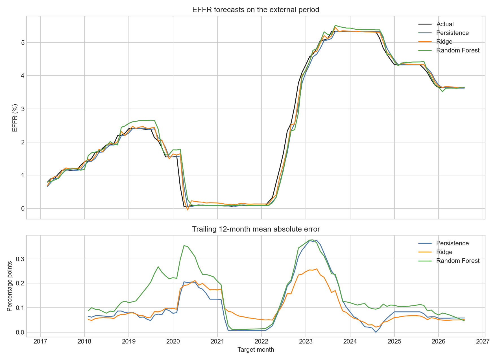

# Forecasting the Effective Federal Funds Rate

A reproducible study of one-month-ahead EFFR forecasts using a persistence baseline, Ridge regression, and Random Forest. The models use lagged rates only, so every forecast has a clear information cutoff.

The model design was developed on data through February 2017 and then frozen. A second Federal Reserve snapshot, covering March 2017 through August 2026, provides the final external test.

**Main finding:** Ridge has the lowest external-period RMSE, at **0.1606 percentage points** versus **0.1922** for persistence. Its MAE advantage is much smaller, and the uncertainty interval includes zero. Random Forest remains worse than both simpler approaches.



## External validation

All features and hyperparameters come from the earlier benchmark. The models are refitted on every usable observation through February 2017, then evaluated on 114 untouched monthly observations. Each prediction uses the rate observed in the previous month; no later-period values are used for fitting or model selection.

- **Persistence:** RMSE **0.1922**, MAE **0.0996**, R² **0.9894**.
- **Ridge:** RMSE **0.1606**, MAE **0.0934**, R² **0.9926**.
- **Random Forest:** RMSE **0.2368**, MAE **0.1393**, R² **0.9839**.

RMSE and MAE are percentage points. For scale, Ridge's RMSE is about 16.1 basis points and persistence's is about 19.2 basis points.

A paired moving-block bootstrap preserves short runs of neighboring months when estimating uncertainty. Ridge improves RMSE over persistence by **0.0317 percentage points** (95% interval **0.0070 to 0.0568**). Its MAE improvement is **0.0062** (95% interval **−0.0174 to 0.0335**), so that smaller difference is not clearly distinguishable from zero. Full results are in [metrics.csv](reports/external/metrics.csv) and [uncertainty.csv](reports/external/uncertainty.csv).

## Reproduce the results

Use Python **3.12**. Both official-source data snapshots are included, so the run does not need an API key or network access.

```bash
git clone https://github.com/agalkova/effr-forecasting-ml.git
cd effr-forecasting-ml
python3 -m venv .venv
source .venv/bin/activate
python -m pip install -r requirements-lock.txt
python -m pip install -e . --no-deps
python -m pytest -q

effr-train --data data/effr_monthly.csv --output reports
effr-external \
  --development-data data/effr_monthly.csv \
  --external-data data/effr_external.csv \
  --frozen-design reports/run.json \
  --output reports/external
effr-verify \
  --data data/effr_monthly.csv \
  --expected reports \
  --external-data data/effr_external.csv \
  --external-expected reports/external
```

On Windows, activate with `.venv\Scripts\Activate.ps1` in PowerShell. The package commands can also be run as Python modules. Direct dependencies are listed in `pyproject.toml`; `requirements-lock.txt` records the tested environment.

## Forecast design

For target month *t*, the inputs are EFFR lags at 1, 2, 3, 6, and 12 months; trailing means and standard deviations over 3, 6, and 12 months; and the preceding monthly change. Every input ends at *t−1*.

The development benchmark uses a chronological 80/20 split and five expanding training folds. Scaling for Ridge is fitted inside each fold. Training CV selected persistence; it also chose the Ridge penalty and Random Forest settings carried into external validation. The later data were opened only after those choices were fixed.

This is a rolling one-step evaluation. Earlier observations in an evaluation period become available to predict the next month, just as they would in regular monthly forecasting. It is not a recursive forecast of an entire decade from a single starting date.

The development holdout results were:

- **Persistence:** CV RMSE **0.4968**; holdout RMSE **0.1526**, MAE **0.0700**.
- **Ridge:** CV RMSE **0.5632**; holdout RMSE **0.1535**, MAE **0.1080**.
- **Random Forest:** CV RMSE **1.2579**; holdout RMSE **0.7514**, MAE **0.6569**.

Random Forest could not extrapolate below the training-period rate floor, which explains much of its poor performance during the post-2008 near-zero-rate period. The external period contains a different mix of rising, near-zero, and falling rates; Ridge's lower RMSE there is evidence that the linear autoregressive features can soften errors around larger monthly moves.

See [methodology.md](docs/methodology.md) for the forecast timing, leakage audit, and uncertainty procedure. Source details and file hashes are in [data/README.md](data/README.md).

## Outputs

- `reports/` contains the development split's predictions, model-selection results, feature importance, figures, and run metadata.
- `reports/external/` contains dated external predictions, metrics, uncertainty intervals, the final figure, and run metadata.
- `tests/` checks feature timing, split isolation, data continuity, frozen parameters, dated outputs, and deterministic uncertainty estimates.
- GitHub Actions reruns the tests and both evaluations, then compares regenerated artifacts with the committed results.

## Scope

EFFR is closely guided by the Federal Reserve's target rate or range, so persistence is a meaningful benchmark. This project studies short-run predictability in the realized monthly rate. It does not attempt to anticipate FOMC decisions; that would require meeting dates, real-time macroeconomic vintages, the target range, and market expectations available on each forecast date.

The study is complete. The feature set, models, evaluation periods, and published results are frozen so the repository remains a reproducible record rather than an expanding collection of experiments.

## Contributors and license

Original project: **Anastasia Galkova and Bakr Bouhaya**. See [LICENSE](LICENSE) for code licensing and [data/README.md](data/README.md) for data attribution and terms.
